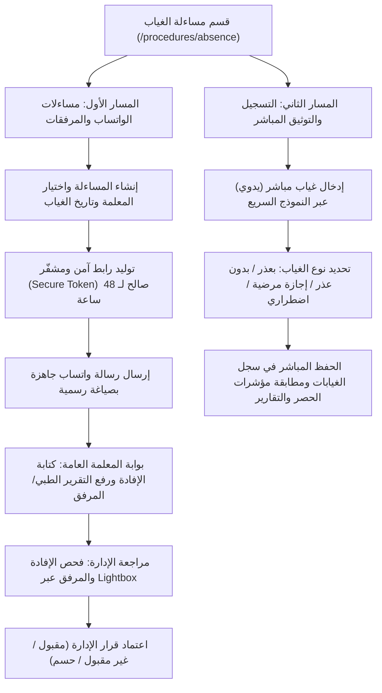
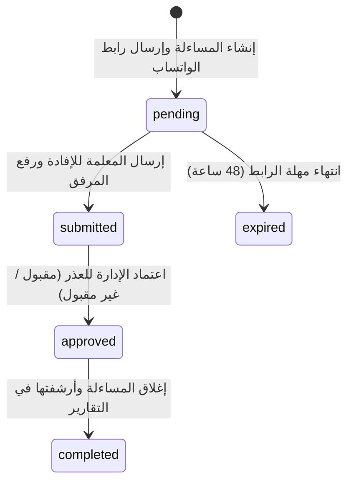

# الدليل والمواصفات الفنية الشاملة لقسم مساءلة الغياب
## Comprehensive Specification & Architecture Guide: Absence Procedure Module

**اسم الوحدة:** مساءلة غياب (المسار الإلكتروني والمباشر)  
**المسار في المنصة:** `/procedures/absence`  
**الهدف الأساسي:** إدارة وتوثيق غيابات الكادر التعليمي، وإرسال المساءلات الرسمية عبر الواتساب واستقبال الإفادات والتقارير الطبية والمرفقات آلياً دون الحاجة لتسجيل دخول المعلمة، مع إمكانية التوثيق المباشر والطباعة المعتمدة بضغطة زر.

---

## 1. الهيكلية العامة وفلسفة المسارين (Dual-Track Architecture)

تم تصميم القسم ليعمل وفق **مسارين متكاملين** يخدمان كافة الحالات التشغيلية في الإدارة المدرسية:



---

## 2. عناصر الواجهة الرئيسية (User Interface Components)

### أ. شريط المؤشرات العلوية (KPI Header Cards)
تتحدث المؤشرات آلياً بناءً على مصفوفة الحسابات اللحظية:
1. **إجمالي الغيابات المسجلة:** المجموع الكلي لجميع أيام الغياب المحفوظة في قاعدة البيانات (يشمل المسجلة مباشرة والمساءلات المكتملة عبر الواتساب).
2. **مساءلات الواتساب:** إجمالي عدد المساءلات التي تم توليد روابط واتساب لها ومتابعتها إلكترونياً، مع إشعار بالردود الجديدة غير المعتمدة.
3. **معلمات شملتهن المساءلة:** عدد المعلمات الفريدات اللاتي سُجل بحقهن غياب أو مساءلة.
4. **الكادر التعليمي المتاح:** إجمالي عدد المعلمات المسجلات والنشطات في المدرسة.

---

### ب. التبويب الأول: مسار مساءلات الواتساب والمرفقات
* **الجدول التفاعلي (`InquiriesTable`):**
  * **شريط الفلاتر:** `الكل`، `بانتظار الرد` (باللون الكهرماني)، `تم الرد` (باللون الأزرق السماوي)، `معتمدة` (باللون الزمردي).
  * **محرك البحث السريع:** البحث الفوري بالاسم أو السجل المدني أو رقم الجوال.
  * **أعمدة الجدول:**
    1. اسم المعلمة ورقم السجل المدني.
    2. رقم الجوال مع بادئة الاتصال.
    3. تاريخ الغياب (ميلادي وهجري).
    4. نوع العذر الموضح (مرضي، اضطراري، ظروف عائلية، أخرى).
    5. المرفق الطبي/الإثبات (زر معاينة سريع يفتح المرفق بجودة عالية عبر Lightbox).
    6. حالة المساءلة (شارة مميزة ملونة للحالة).
    7. الإجراءات (عرض التفاصيل، مراجعة واعتماد الإفادة، إعادة إرسال الرابط، طباعة PDF، نقل للأرشيف).

---

### ج. التبويب الثاني: مسار التسجيل والتوثيق المباشر
* **نموذج الإدخال السريع (`AbsenceForm`):**
  * القائمة المنسدلة الذكية للبحث عن المعلمة (`TeacherCombobox`).
  * تحديد تاريخ الغياب وعدد الأيام.
  * اختيار نوع الغياب والحالة المبدئية.
* **جدول الغيابات الحديثة (`RecentAbsencesTable`):**
  * عرض السجلات المدخلة يدوياً مع إمكانية التعديل، التحويل إلى مساءلة، أو الحذف الآمن.

---

## 3. دورة حياة المساءلة الإلكترونية (Workflow Lifecycle)



1. **حالة بانتظار الرد (`pending`):**
   * يتم توليد كود تحقق عشوائي فريد وغير قابل للتخمين (Secure Hash Token).
   * الرابط مخصص للمعلمة ولا يتطلب منها تسجيل الدخول.
2. **حالة تم الرد (`submitted`):**
   * تقوم المعلمة بإدخال تبرير الغياب وإرفاق التقرير الطبي بصيغة صورة أو PDF.
   * يتم تسجيل بصمة الوقت وعنوان IP وتحديث الحالة فوراً.
3. **حالة معتمدة (`approved` / `completed`):**
   * تراجع مديرة المدرسة أو الوكيلة المرفق والإفادة عبر نافذة المراجعة (`DirectorDecisionModal`).
   * يتم اختيار القرار (عذر مقبول / غير مقبول / إحالة للحسم) وحفظ توقيع وختم الاعتماد.

---

## 4. المواصفات الفنية والأمنية (Technical & Security Specifications)

| الخاصية | التفاصيل الفنية والتقنية |
| :--- | :--- |
| **أمان الروابط (Token Security)** | توليد UUID v4 مشفر مرتبط بـ `inquiry_id` واحد فقط مع صلاحية زمنية مدتها 48 ساعة لمنع التخمين أو التلاعب. |
| **رفع ومعاينة المرفقات** | تخزين مشفر في Supabase Storage Bucket مع دعم ضغط الصور المسبق، ومعاينة داخلية عبر مكون `AttachmentViewerModal` لمنع الحظر الأمني لمتصفحات كروم وإيدج. |
| **محرك الطباعة (PDF Engine)** | توليد مستندات رسمية مطابقة لنماذج وزارة التعليم واللوائح الوزارية متضمنة شعار الوزارة، الترويسة المعتمدة، خط Cairo العربي، والتوقيع والختم المعتمد إلكترونياً. |
| **التوافق التام مع الوضع الليلي** | دعم كامل للـ Dark Mode والـ Light Mode مع تباين لوني مدروس (Slate 950 / Emerald / Amber / Sky). |
| **التكامل مع مركز الحصر والتقارير** | ترتبط البيانات آنياً بمحرك الإحصائيات الشامل `lib/reportsEngine.ts` ومركز الحصر `ComprehensiveStatsCenter` لتعكس بدقة نسب الغياب والأعذار. |

---

## 5. نماذج الرسائل والطباعة المعتمدة

### أ. نص رسالة الواتساب التلقائية:
```text
السلام عليكم ورحمة الله وبركاته
الأستاذة / {اسم المعلمة}
نفيدكم بأنه تم تسجيل غيابكم عن الدوام الرسمي بتاريخ: {تاريخ الغياب}
نأمل منكم الدخول على الرابط التالي لتسجيل إفادتكم وإرفاق التقرير الطبي أو ما يثبت العذر:
{رابط المساءلة المباشر}
شاكرين ومقدرين حسن تعاونكم.
إدارة المدرسة
```

### ب. عناصر مستند الـ PDF المطبوع:
1. **الترويسة الرسمية:** المملكة العربية السعودية - وزارة التعليم - الإدارة العامة للتعليم - اسم المدرسة.
2. **بيانات المساءلة:** الاسم، السجل المدني، التخصص، اليوم، التاريخ.
3. **إفادة المعلمة:** نص الإفادة ونوع العذر وتاريخ الإرسال.
4. **قرار الإدارة المعتمد:** (مقبول / غير مقبول) مع الملاحظات.
5. **الاعتمادات والتواقيع:** توقيع وكيلة الشؤون التعليمية، مديرة المدرسة، وختم المنشأة التعليمية.
